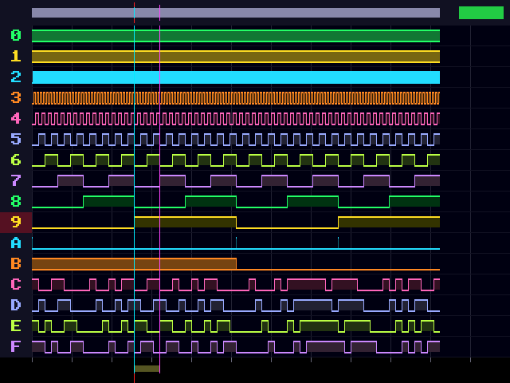
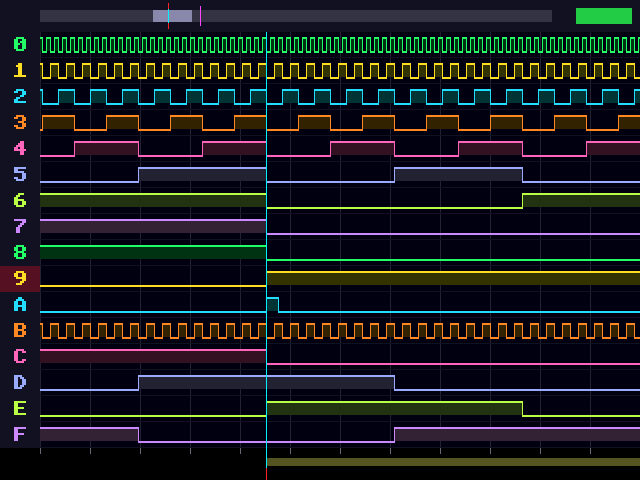

# FPGA Logic Analyzer for the Nexys A7

A standalone 16-channel logic analyzer for the **Digilent Nexys A7** (Artix-7, 100T or 50T). It captures digital signals from two Pmod headers and draws the waveforms live on a VGA monitor. You don't need a PC or any software after configuration.

This is a port and redesign of [epictetushmu/fpga-logic-analyzer](https://github.com/epictetushmu/fpga-logic-analyzer), which targeted the Nexys2 (Spartan-3E). It is written in VHDL and builds in Vivado.



## Specifications

| | |
|---|---|
| Channels | 16 (Pmod JA = ch0–7, Pmod JB = ch8–15) |
| Sample rate | 100 MS/s ÷ 2ⁿ, n = 0…15 (100 MS/s down to 3.05 kS/s) |
| Memory depth | 4096 samples per capture in block RAM, double-buffered |
| Trigger | auto / rising / falling / any edge on any channel; 0, 25, 50 or 75 % pre-trigger |
| Modes | single shot (with force trigger) or continuous |
| Display | VGA 640×480 @ 60 Hz, 12-bit colour |
| View | 8 zoom levels (8 samples/pixel to 16 pixels/sample), scrolling, two measurement cursors |
| Extras | built-in test pattern generator (also output on JC/JD), live input LEDs, 7-segment readout |
| Resources | about 1.3 k LUTs, 1.1 k FFs, 4 RAMB36 (well under 5 % of an XC7A100T) |

Glitches shorter than one pixel column are not lost when zoomed out. Each column inspects every sample it covers, and a channel that toggled inside the column is drawn as a "busy" band.

## Changes from the Nexys2 original

| Nexys2 version | This version |
|---|---|
| Spartan-3E, 50 MHz clock | Artix-7, 100 MHz clock, single clock domain |
| External SRAM buffer | On-chip block RAM, even/odd split and ping-pong banks |
| 40-pin FX2 header inputs | Pmod JA + JB inputs (with pull-downs) |
| ISE-era project files | Script-generated Vivado project (`scripts/create_project.tcl`) |

## Getting started

### Requirements
- Nexys A7-100T (or -50T) and its micro-USB cable
- VGA monitor and cable
- Vivado 2019.1 or newer. The free ML Standard / WebPACK edition is enough.

### Build in the Vivado GUI
1. Open Vivado, then go to **Tools → Run Tcl Script…** and pick `scripts/create_project.tcl`.
   For the **50T** board, type the following in the Tcl console instead:
   `set argv 50t; source <repo>/scripts/create_project.tcl`
2. Click **Generate Bitstream**.
3. Open **Hardware Manager → Open Target → Auto Connect → Program Device**.

### Build from the command line
```bash
vivado -mode batch -source scripts/create_project.tcl          # once (add -tclargs 50t for the 50T)
vivado -mode batch -source scripts/build.tcl                   # synth + impl -> ./la_top.bit
vivado -mode batch -source scripts/program.tcl                 # load into the board over USB
```
`build.tcl` also writes `vivado_proj/utilization.rpt` and `vivado_proj/timing.rpt`, and prints the worst slack.

### First test without wiring
Set **SW11 = 1** (internal test pattern) and **SW10 = 1** (continuous), then press **CPU_RESET**. The screen shows a counter, a PWM signal, a burst signal and pseudo-random data. To test the real input path, set SW11 = 0 and loop the pattern back with 8 + 8 jumper wires: **JC → JA** and **JD → JB**, pin for pin.

## Wiring

Pmod pin numbering (looking at the board edge): the top row is pins 1–6 and the bottom row is pins 7–12.

| Pmod pin | 1 | 2 | 3 | 4 | 5 | 6 | 7 | 8 | 9 | 10 | 11 | 12 |
|---|---|---|---|---|---|---|---|---|---|---|---|---|
| **JA** | ch0 | ch1 | ch2 | ch3 | GND | 3V3 | ch4 | ch5 | ch6 | ch7 | GND | 3V3 |
| **JB** | ch8 | ch9 | ch10 | ch11 | GND | 3V3 | ch12 | ch13 | ch14 | ch15 | GND | 3V3 |

Always connect **GND** between the board and the circuit you measure.

> ⚠️ **3.3 V logic only.** The Artix-7 I/Os are *not* 5 V tolerant. For 5 V signals, use a level shifter or at least a resistor divider. Unconnected inputs are pulled low.

## Controls

### Switches
| Switch | Function |
|---|---|
| SW3–SW0 | Sample rate n: fs = 100 MHz / 2ⁿ (0 = 100 MS/s, 4 = 6.25 MS/s, 10 = 97.7 kS/s, 15 = 3.05 kS/s) |
| SW7–SW4 | Trigger channel 0–15 |
| SW9–SW8 | Trigger mode: 00 auto, 01 rising, 10 falling, 11 any edge |
| SW10 | 1 = continuous (re-arms after every capture), 0 = single shot |
| SW11 | 1 = analyse the internal test pattern, 0 = Pmod inputs |
| SW13–SW12 | Pre-trigger: 00 = 0 %, 01 = 25 %, 10 = 50 %, 11 = 75 % |
| SW15–SW14 | What BTNL/BTNR do: 00 scroll, 01 move cursor A, 10 move cursor B, 11 move both |

Capture window = 4096 / fs. For example, n = 0 gives 41 µs, n = 8 gives 10.5 ms and n = 15 gives 1.34 s.

### Buttons
| Button | Function |
|---|---|
| BTNC | Continuous mode: run/stop. Single mode: arm; press again while waiting to **force** a trigger |
| BTNU / BTND | Zoom in / out, centred on cursor A |
| BTNL / BTNR | Scroll or move cursors (see SW15–14). Hold for auto-repeat; hold longer for big steps |
| CPU_RESET | Reset |

### Indicators
- **LED0–LED15**: live level of each input channel.
- **RGB LED16**: green = capture held, amber = armed and waiting for the trigger, blue = capturing, red = stopped (continuous mode).
- **7-segment display**: `BBBB.T M.RR`, where:
  - `BBBB` is the distance between the cursors in samples. Multiply by 2ⁿ × 10 ns for time.
  - `T` is the trigger channel (hex).
  - `M` is the trigger mode.
  - `RR` is the rate setting n.

## Screen layout



- **Top bar**: overview of the whole 4096-sample buffer. The light part is the visible window, the red ticks mark the trigger and the cyan/magenta ticks mark cursors A/B. The lamp at the right shows the capture state in the same colours as LED16, with grey for stopped.
- **16 channel rows**, with hex labels on the left. The label of the trigger channel is highlighted in red.
- **Red dashed line**: the trigger point. **Cyan / magenta lines**: cursors A / B.
- **Bottom ruler**: grid, sample ticks at high zoom, and a yellow bar spanning cursor A to B.

New captures are written to the hidden bank and swapped in during vertical blank, so the screen never shows a half-written capture.

## Simulation

The `sim/` folder contains two testbenches, which both run in Vivado XSim and in GHDL:

- **`tb_capture`**: self-checking test of the capture engine. It checks rising, falling, any-edge and auto triggers, all pre-trigger settings, several rates and force trigger, and verifies every one of the 4096 stored samples. It ends with `ALL TESTS PASSED`. This is the default sim top in the Vivado project, so run **Run Simulation → Run Behavioral Simulation**.
- **`tb_la_top`**: the whole design running on the test pattern. It records the VGA output to `frame_overview.ppm` and `frame_zoomed.ppm` (the images in this README came from it). `scripts/ppm2png.py` converts them to PNG. It simulates about 100 ms, which is slow in XSim, so GHDL is the better tool for it:

```bash
./scripts/sim_ghdl.sh        # capture test (~2 s)
./scripts/sim_ghdl.sh full   # + full-system frames (~6 min)
```

## Source files

```
rtl/
  la_top.vhd        top level: I/O, synchronisers, wiring, LEDs
  la_pkg.vhd        shared constants (channels, depth, screen layout)
  capture_ctrl.vhd  sample-rate divider, trigger, pre/post-trigger, bank swap
  sample_ram.vhd    inferred block RAM (even and odd sample halves)
  display.vhd       6-stage pixel pipeline, waveform renderer
  vga_timing.vhd    640x480@60 timing with a 25 MHz pixel enable
  ui_ctrl.vhd       zoom / scroll / cursors
  btn_debounce.vhd  debounce and auto-repeat
  seg7_ctrl.vhd     8-digit display with binary-to-BCD conversion
  test_pattern.vhd  built-in signal generator
constr/nexys_a7.xdc pin constraints (from Digilent's master XDC)
sim/                testbenches
scripts/            Vivado project, build and program scripts, GHDL runner
```

### Changing the design
- **More samples**: raise `ADDR_W` in `la_pkg.vhd`. 13 gives 8192 samples (8 RAMB36). The overview bar scales automatically.
- **Different pins**: edit `constr/nexys_a7.xdc`. JC/JD can become inputs by swapping them with JA/JB in `la_top.vhd`.

## License
GPL-3.0, same as the original project.
